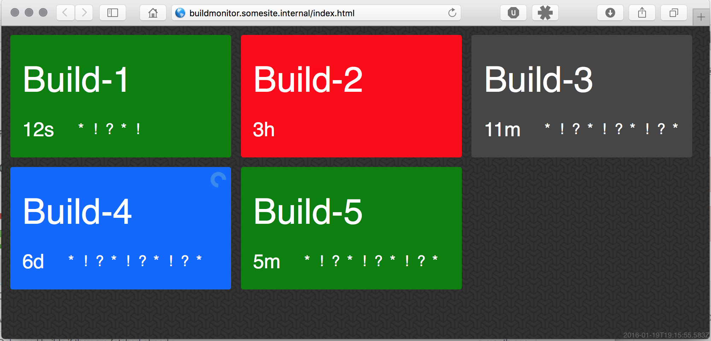

# clj-build-monitor

A CI build monitor for displaying build status on a big screen. Currently supports Teamcity and Jenkins CI services.

## Description

The build monitor displays builds of configured projects in the order they appear in the configuration, in order to provide at-a-glance overview of what the status of each project is.

Each build can be in one of four states as indicated by the color:
* Green - successful build
* Red - broken build
* Blue - currently running build
* Gray - canceled build or unknown status

In addition to color each project provides a human-readable time of last build and an overview of recent history of builds. The history uses the following symbols to represent build statuses:
* * - successful
* ! - broken
* ? - canceled or unknown

## Requirements

Requires Java 8 for running.

For developing also requires [Leiningen](http://leiningen.org/).

## Building

To build the production package run `lein uberjar`. This builds a standalone jar file into `target/clj-build-monitor.jar`.

## Running

First, create a configuration file for the application by copying the `conf.json.template` file to `conf.json` and editing
it as needed.

To launch the server, run `java -jar clj-build-monitor.jar` in the same directory as the configuration file. This starts 
the server listening on port 3000, which you can access by pointing your browser to it.
 
To start the server on another port set the `PORT` environment variable: `PORT=4444 java -jar clj-build-monitor.jar`.

## Development

To develop the build monitor launch the server in one terminal: `lein run`. In another terminal start the Clojurescript
compiler: `lein with-profile dev cljsbuild auto`.

Then point your browser at `http://localhost:3000/` and your editor at the source files and hack away.

If you're tweaking the UI code or design then it can be helpful to add a service with type 'dummy' to generate dummy data
with all possible build states.
